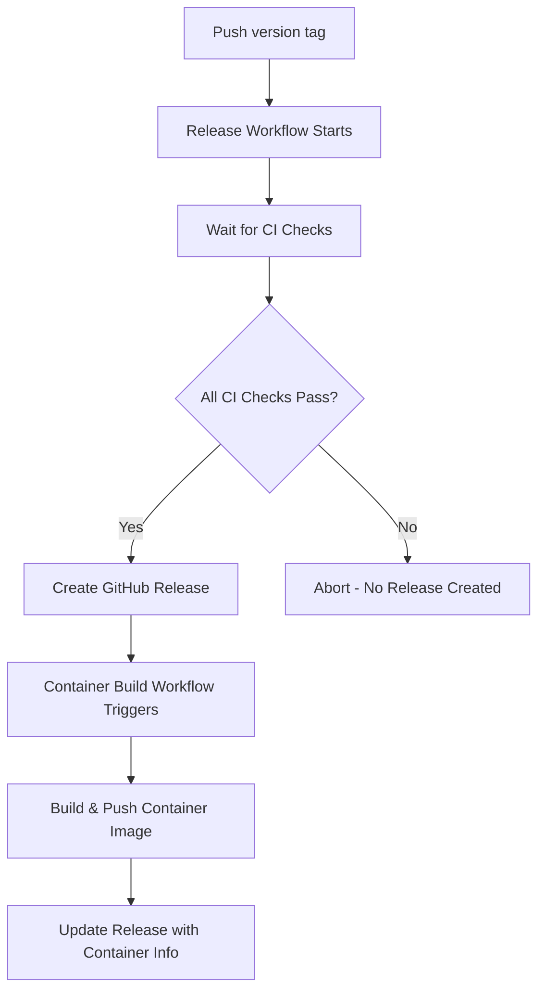

# Release Process

This repository uses an automated release process that ensures container images are only built for releases, and releases are only created when all CI checks pass.

## Workflow Overview

### 1. CI Workflow (`.github/workflows/ci.yml`)
- Runs on every push and pull request
- Executes: linting, type checking, tests, and build
- **All these checks must pass** before a release can be created

### 2. Release Workflow (`.github/workflows/release.yml`)
- Triggers on version tag pushes (e.g., `v1.0.0`)
- **Waits for all CI checks to complete and pass**
- Only creates a GitHub release if all checks succeed
- Generates changelog from git commits
- Fails fast if any CI checks fail

### 3. Container Build Workflow (`.github/workflows/container-build.yml`)
- Triggers on version tags (`v*.*.*`) on main
- Builds and pushes container image to the private registry (`registry.niepi.org`)
- Includes security scanning with Trivy

## Creating a Release

To create a new release:

1. **Ensure your code is ready**: All tests pass, code is reviewed
2. **Create and push a version tag**:
   ```bash
   git tag v1.0.0
   git push origin v1.0.0
   ```
3. **Monitor the workflows**:
   - Release workflow will wait for CI checks
   - If CI passes → Release is created
   - If CI fails → Release creation is aborted
   - Container build starts automatically after release creation

## Workflow Dependencies



## Benefits

- ✅ **Quality Gate**: No releases without passing tests
- ✅ **Automated**: Push tag → Everything else is automatic
- ✅ **Safe**: Failed CI = No release = No container image
- ✅ **Traceable**: Clear changelog and container availability
- ✅ **Secure**: Container images are scanned before push

## Troubleshooting

### Release workflow fails with "Some CI checks failed"
- Check the CI workflow for the specific commit/tag
- Fix any failing tests, linting, or build issues
- Delete and recreate the tag after fixes

### Container build fails
- Check the container-build workflow logs
- Common issues: Trivy security scan failures, Docker build errors
- Release still exists, container can be built manually if needed

### No container image available
- Verify the release was actually created (not just tagged)
- Check if container-build workflow completed successfully
- Container images are available at: `registry.niepi.org/simple-transit:[version]`